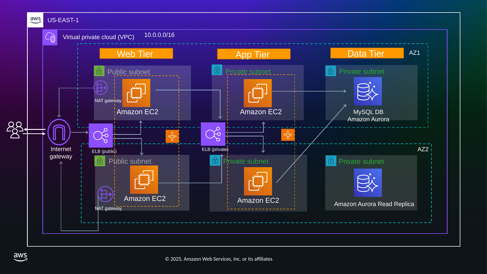

# AWS Three-Tier Web Application

A reference walkthrough of a classic **three-tier web application built entirely with AWS native services**. The project demonstrates how a layered architecture — web, application, and database — delivers the four pillars that matter for modern, user-facing systems: **scalability, high availability, resiliency, and security**.

It is built to be approachable for people who are new to AWS: the goal is not just to name the components, but to explain *why* each one is there and *what* capability it unlocks.

---

## Table of contents

- [What is a three-tier architecture?](#what-is-a-three-tier-architecture)
- [The four pillars](#the-four-pillars)
- [How traffic flows](#how-traffic-flows)
- [Networking foundation](#networking-foundation)
- [Web tier](#web-tier)
- [Application tier](#application-tier)
- [Database tier](#database-tier)
- [Security groups](#security-groups)
- [Technology stack](#technology-stack)
- [Capabilities demonstrated](#capabilities-demonstrated)
- [Possible production extensions](#possible-production-extensions)
- [Project materials](#project-materials)
- [Author](#author)

---

## What is a three-tier architecture?

The three-tier pattern is a well-established structure for user-facing applications. It separates an application into three distinct, interconnected layers, each with a single clear responsibility.

The **web tier** (presentation tier) is the part users interact with directly — the face of the application. In this demo it is a dynamic web page, but the same role could be filled by a mobile or desktop front end. The **application tier** (logic tier) is the engine room, where requests from the UI are turned into real operations; here it handles simple CRUD work and light data processing. The **database tier** (data tier) is the persistent storage layer, where the application's data is stored, managed, and retrieved.

Keeping these concerns separate is what makes each layer independently scalable, replaceable, and securable.

---

## The four pillars

The layered approach exists to deliver four characteristics, and the AWS services in this project map directly onto them:

| Pillar | What it means | How it's achieved here |
|--------|---------------|------------------------|
| **Scalability** | Grow to meet demand | Auto Scaling Groups, Elastic Load Balancing |
| **High availability** | Always accessible | Resources spread across two Availability Zones |
| **Resiliency** | Recover from failure | ALB health checks, ASG self-healing, Aurora failover |
| **Security** | Protect data and services | Private subnets, layered security groups, Session Manager |

---

## How traffic flows

A request travels through the tiers like this:

1. A user reaches the application through the **public (external) Application Load Balancer's** DNS name — the front door.
2. The public ALB forwards traffic to the **web tier EC2 instances**, which run **NGINX** serving a **React.js** site.
3. The web tier redirects API calls to the **internal (private) Application Load Balancer**.
4. The internal ALB forwards those calls to the **application tier EC2 instances** running **Node.js**.
5. The app tier processes the request and reads from / writes to the **Amazon Aurora (MySQL-compatible)** database.
6. The result is returned back up through the tiers to the user.

---

## Networking foundation

Before any tier exists, the network is the skeleton everything is built on. Everything is deployed in the **us-east-1** region (you would normally pick the region closest to your users to minimize latency).

**VPC.** A single Amazon VPC provides a logically isolated section of the AWS cloud, defined by the CIDR range `10.0.0.0/16`. That range is deliberately large enough to supply plenty of private IP addresses and to be subdivided into six subnets.

**Subnets.** Six subnets are spread across two Availability Zones (`us-east-1a` and `us-east-1b`) — two per tier:

| Tier | Subnet type | Count | Reason |
|------|-------------|-------|--------|
| Web | Public | 2 | Reachable from the internet via the load balancer |
| Application | Private | 2 | Not directly reachable from the internet |
| Database | Private | 2 | Not directly reachable from the internet |

Using two AZs — each a set of discrete data centers with independent power, networking, and connectivity — is the fundamental practice for fault tolerance and high availability.

**Internet Gateway (IGW).** A single, horizontally scaled, highly available IGW is attached to the VPC to allow communication between the VPC and the internet.

**NAT Gateways.** Two NAT Gateways (one in each public subnet, one per AZ) let instances in private subnets make *outbound* connections — for example, to download software updates — while preventing the internet from *initiating* connections to them. Note that NAT Gateways must live in **public** subnets; placing them in a private subnet would not provide connectivity. Running one per AZ means that if one AZ's path fails, the other AZ's private instances keep their internet access.

**Route Tables.** Three logical route table configurations direct the traffic: the public route table sends all non-VPC traffic to the IGW (and is associated with both public subnets), while the private route tables send all non-VPC traffic to the NAT Gateway in their own AZ.

---

## Web tier

The web tier is the entry point and is made of three cooperating components.

**Public Application Load Balancer.** Elastic Load Balancing automatically distributes incoming traffic across multiple targets in multiple AZs. It listens for HTTP on **port 80** and forwards requests to a target group (`web-tg`) containing the two web EC2 instances (one per AZ). The ALB continuously runs health checks; if an instance becomes unhealthy it stops sending traffic there and reroutes to the healthy instances — the core of the tier's resiliency.

**Auto Scaling Group (`web-asg`).** The ASG keeps the desired number of instances running:

| Setting | Value |
|---------|-------|
| Minimum capacity | 2 |
| Desired capacity | 2 |
| Maximum capacity | 2 *(could be higher in production)* |
| Availability Zones | 2 |

If an instance terminates, the ASG detects the shortfall and launches a replacement automatically.

**Launch Configuration / Template (`web-launch-config`).** This defines *what* the ASG launches: a custom **AMI**, instance type, and IAM permissions. The AMI was created by launching an Amazon Linux 2 instance, installing NGINX, deploying the React build, configuring everything, and then imaging it — so every new instance comes up identically and quickly.

---

## Application tier

The application tier mirrors the web tier, with the differences in the details.

Traffic from the web instances goes to an **internal Application Load Balancer** — "internal" meaning it only has a private IP and is reachable only from inside the VPC, which is a security best practice. It forwards traffic to the `app-tg` target group, whose instances listen on the Node.js application port (e.g. **port 4000**).

Like the web tier, the app instances are managed by their own Auto Scaling Group (`app-asg`) and Launch Configuration (`app-launch-config`), using a different AMI that contains the Node.js application code and its dependencies. These instances live in the **private** app subnets and have **no public IP addresses**.

**Access without SSH — AWS Systems Manager Session Manager.** Because the instances have no public IPs and no open SSH ports, administration is done through Session Manager, a managed, browser- or CLI-based shell. The benefits:

- No inbound SSH/RDP ports to open
- No bastion / jump hosts to maintain
- No SSH keys to manage
- Access governed entirely by **IAM policies**

A simple `ping` to the internet from an app instance confirms that — despite having no public IP — it can still reach out through the NAT Gateway.

---

## Database tier

The data layer uses **Amazon Aurora with MySQL compatibility**, part of Amazon RDS, which simplifies setting up, operating, and scaling a relational database.

A **DB Subnet Group** restricts the database to the two private database subnets (`private-db-subnet-az1` and `private-db-subnet-az2`), keeping it off the internet. The Aurora cluster (`demo-db-cluster`) runs two instances:

- A **writer instance** — its endpoint handles both reads and writes.
- A **reader instance (read replica)** — designed to absorb heavy read traffic.

**Automatic failover** is the key high-availability feature: if the writer becomes unavailable (an AZ outage or instance failure), Aurora can promote the reader in the other AZ to be the new writer. The application then simply connects to the new writer endpoint, keeping downtime minimal.

---

## Security groups

Security groups are **stateful virtual firewalls** at the resource level — if outbound traffic is allowed, the corresponding return traffic is allowed automatically. The design follows the **principle of least privilege**: each layer only accepts traffic from the layer directly in front of it, forming a chain.

| Security group | Inbound (allowed source → port) | Outbound |
|----------------|----------------------------------|----------|
| `external-alb-sg` | `0.0.0.0/0` → 80 *(restrict to your IP for a demo)* | All |
| `web-ec2-sg` | `external-alb-sg` → 80 | To `internal-alb-sg` |
| `internal-alb-sg` | `web-ec2-sg` → 80 / 4000 | — |
| `app-ec2-sg` | `internal-alb-sg` → 4000 | To `db-sg` |
| `db-sg` | `app-ec2-sg` → 3306 (MySQL) | — |

Because the chain only ever trusts the previous tier, the database can *only* be reached from the application tier, the application tier *only* from the internal load balancer, and so on back to the public entry point. Removing your IP from `external-alb-sg` instantly cuts off access to the whole site — a quick way to see the firewall working.

---

## Technology stack

| Layer | Technology / AWS service |
|-------|--------------------------|
| Region | AWS `us-east-1`, 2 Availability Zones |
| Network | Amazon VPC (`10.0.0.0/16`), 6 subnets, IGW, 2× NAT Gateway, route tables |
| Web tier | Amazon EC2 (Amazon Linux 2), **NGINX**, **React.js**, public ALB |
| App tier | Amazon EC2, **Node.js**, internal ALB |
| Scaling | Auto Scaling Groups + Launch Configurations / Templates |
| Database | **Amazon Aurora (MySQL-compatible)** via Amazon RDS, writer + read replica |
| Access | AWS Systems Manager Session Manager |
| Security | Security groups (least-privilege chain), public/private subnet isolation |

---

## Capabilities demonstrated

- **Self-healing.** Terminating a web instance triggers the ASG to automatically launch an identical replacement in the same AZ.
- **Health-based routing.** The ALB stops routing to unhealthy instances and spreads traffic across AZs.
- **Database failover.** Aurora can promote the read replica to writer if the primary fails.
- **Private outbound access.** Private instances reach the internet through NAT Gateways without being internet-reachable.
- **Keyless administration.** Session Manager provides shell access with no SSH ports, keys, or bastion hosts.
- **Defense in depth.** Layered security groups restrict each tier to traffic from the tier in front of it.

---

## Possible production extensions

This is a solid foundation rather than a finished production system. Natural next steps include a **CDN** (Amazon CloudFront) for global performance, a **Web Application Firewall** or **API Gateway** to strengthen the security posture, and managed services for **user authentication** (e.g. Amazon Cognito) and **domain management** (Amazon Route 53). Raising the Auto Scaling maximums and adding scaling policies would let the tiers grow under real load.

---

## Project materials

| File | Description |
|------|-------------|
| [`docs/architecture-diagram.png`](docs/architecture-diagram.png) | The architecture diagram shown above |
| [`docs/presentation.pptx`](docs/presentation.pptx) | The full slide deck |
| [`docs/narration-script.pdf`](docs/narration-script.pdf) | The narrated walkthrough script |
| [`docs/walkthrough.mp4`](docs/walkthrough.mp4) | Recorded video walkthrough of the AWS console |

> **Video note:** the walkthrough video is ~39 MB. GitHub allows files up to 100 MB, but for a leaner repository you may prefer to host it on YouTube/Loom and link it here, or track it with [Git LFS](https://git-lfs.com/). See the project notes for details.

---

## Author

**Yevhen Prudyus**
Cloud Engineering Fellow — Silver Lining SysOps Fellowship Program (AWS Internship), Feb 2025 – Aug 2025
Chicago, Illinois, United States · Remote
 
[LinkedIn](https://www.linkedin.com/in/yevhenprudyus/)
 
> Built as a hands-on demonstration of AWS three-tier architecture during a 26-week AWS cloud engineering fellowship. AWS service names and icons are trademarks of Amazon Web Services, Inc.
